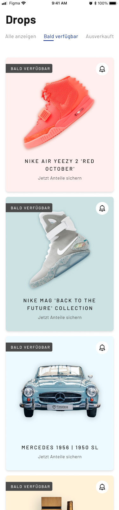
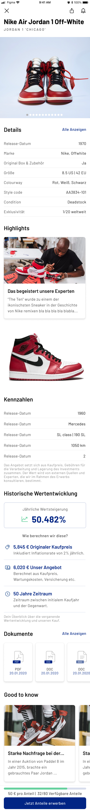

# Timeless react-native coding challenge

To get an impression of how you are working with react-native we want you to
spend some time to implement a simple app to show an overview and detail view of
the assets currently hosted on timeless.investments.

the endpoints to retrieve the data are:

- `https://api.timeless.investments/assets` - returns all assets
- `https://api.timeless.investments/assets/{ID}` - the full dataset for the
  asset with the given ID
- `https://api.timeless.investments/assets/{ID}/details` - a list of details
  specific to the asset with the given ID

As an inspiration you can use these designs of our app taken from figma:

## expected scope

- as an initial page the app should show the list of assets
- by pressing an asset the app should navigate to the detail page
- the implementation should show some kind of persistent state, like the
  subscriptions to notifications of assets (the bell icon, on the assets tile).
  This does not need to be connected to a backend and can be mocked locally
- for the implementation you should not spend too much time, please keep it
  around 4 hours and prioritize the topics that are important for you

- in the folder `./assets` you can find some icons used in the designs, and some
  files used in our design system to describe our colors, typography, shadows
  and other design elements

- to submit the coding challenge please fork this repository and submit a pull
  request with your solution
